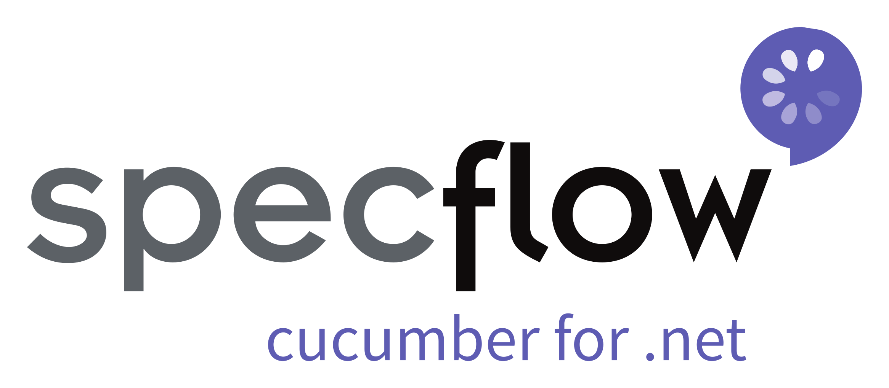
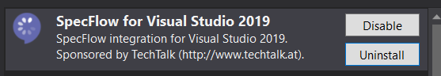

# RestApiTesting.ApiAutomationChallenge 

This is a RESTful API testing framework using **C#**, **.NET Core**, **SpecFlow (BDD)**, **xUnit**, **Flurl**, and **FluentAssertions**, built to test the [JSONPlaceholder](https://jsonplaceholder.typicode.com/) API with modern, readable, and maintainable test practices.

---

## 🎯 Purpose

The goal of this project is to provide a simple but powerful testing architecture using SpecFlow for behavior-driven development, validating CRUD operations against a real (fake) REST API.

---

## ⚙️ Technologies Used

| Technology | Description |
|-----------|-------------|
| [.NET Core](https://dotnet.microsoft.com/) | Multi-platform framework |
| [SpecFlow](https://specflow.org/) | BDD tool for .NET |
| [xUnit](https://xunit.net/) | Unit test framework |
| [Flurl](https://flurl.dev/) | Fluent HTTP client |
| [FluentAssertions](https://fluentassertions.com/) | Fluent style assertions |
| [JSONPlaceholder](https://jsonplaceholder.typicode.com/) | Fake REST API for testing |

---

## 🧪 Test Scenarios Overview

Each scenario validates common REST interactions for `/posts` in JSONPlaceholder:

### 🟢 CreatePostsFeature
- **A non-authenticated user successfully creates a post**  
  Verifies that the API accepts and processes a POST request with valid data.

### 🔴 DeletePostsFeature
- **A non-authenticated user attempts to delete a post with nonexistent id**  
  Ensures proper handling when attempting to delete a resource that doesn’t exist.
- **A non-authenticated user successfully deletes a post**  
  Validates that deleting an existing post returns an appropriate success status.

### 🔎 GetPostsFeature
- **A non-authenticated user attempts to get a post with nonexistent id**  
  Confirms the service returns a proper response when the resource is not found.
- **A non-authenticated user successfully gets a post**  
  Validates that a valid post can be retrieved successfully.
- **A non-authenticated user successfully retrieves all posts**  
  Ensures the API returns a full list of posts with valid structure and status 200.

### 🟠 PatchPostsFeature
- **A non-authenticated user attempts to patch a post with nonexistent id**  
  Checks the behavior of partial updates on a non-existent resource.
- **A non-authenticated user successfully patches a post**  
  Validates that patching part of an existing post works correctly.

### 🔵 UpdatePostsFeature
- **A non-authenticated user attempts to update a post with nonexistent id**  
  Ensures proper handling when fully updating a post that doesn’t exist.
- **A non-authenticated user successfully updates a post**  
  Confirms successful PUT request behavior on an existing post.

---

## 🔺 Top 5 Most Critical Test Scenarios

1. **A non-authenticated user successfully creates a post**  
   → Core functionality. Ensures that the API accepts and processes a POST request with valid data.

2. **A non-authenticated user successfully retrieves all posts**  
   → Confirms that the API correctly returns a full list of resources and that response deserialization works as expected.

3. **A non-authenticated user successfully updates a post**  
   → Validates complete resource replacement using the PUT method and checks for data integrity after the update.

4. **A non-authenticated user attempts to delete a post with nonexistent id**  
   → Ensures the API handles invalid deletion attempts gracefully and returns appropriate status codes.

5. **A non-authenticated user successfully gets a post**  
   → Validates that the API correctly returns an individual resource when a valid ID is provided.

---

## 📂 Target Framework 

Developed in **.NET Core 2.1**

---

## 🧠 SpecFlow 

Use SpecFlow to define, manage and automatically execute human-readable acceptance tests in .NET projects.

### 🧩 Context Injection

Group shared state into context classes and inject them into binding classes using SpecFlow's built-in dependency injection.

Docs: https://specflow.org/documentation/Context-Injection/

---

## 🌠JSONPlaceholder API 

JSONPlaceholder is a free online REST API you can use for testing, prototyping, and demos.

Docs: https://jsonplaceholder.typicode.com/

---

## 🔀 Routes Tested

| HTTP Method | Endpoint        |
|-------------|-----------------|
| GET         | `/posts`        |
| GET         | `/posts/{id}`   |
| POST        | `/posts`        |
| PUT         | `/posts/{id}`   |
| PATCH       | `/posts/{id}`   |
| DELETE      | `/posts/{id}`   |

---

## 🌠Flurl 

Flurl is a fluent, testable, asynchronous HTTP client library for .NET.

Docs: https://flurl.dev/

---

## ✅ Assertions 

FluentAssertions is used for expressive and readable assertions.

Docs: https://fluentassertions.com/

---

## 💻 IDE & Tools

Developed in **Microsoft Visual Studio 2022 Community Edition**

### Visual Studio Extension
- Extensions → Manage Extensions → Install "SpecFlow for Visual Studio"  


### 🔨 Build
- Build → Build Solution  


### 🧪 Run Tests
- Test → Windows → Test Explorer → Run All  


### 📟 Run Tests via Command Line
```bash
cd .\RestApiTesting.ApiAutomationChallenge\bin\Debug\netcoreapp2.1
dotnet vstest RestApiTesting.ApiAutomationChallenge.dll
